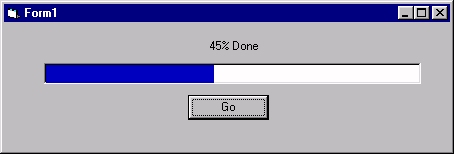



## ProgressBar without OCX's \- only a few lines of code\!

### Description

The Visual Basic Progressbar requires the huge comctrl32.ocx to be distributed with your program - not any more! this is the classic method with the familiar dark-Blue on white background. I have been asked this over and over again, so here it is. It is actually 2 labels stuck together with a bit of arithmetic used to animate them.
 
### More Info
 

             |
---                |---
**Submitted On**   |2000-11-09 02:34:44
**By**             |[Jason Bennison](https://github.com/Planet-Source-Code/PSCIndex/blob/master/ByAuthor/jason-bennison.md)
**Level**          |Beginner
**User Rating**    |5.0 (25 globes from 5 users)
**Compatibility**  |VB 4\.0 \(32\-bit\), VB 5\.0, VB 6\.0
**Category**       |[Coding Standards](https://github.com/Planet-Source-Code/PSCIndex/blob/master/ByCategory/coding-standards__1-43.md)
**World**          |[Visual Basic](https://github.com/Planet-Source-Code/PSCIndex/blob/master/ByWorld/visual-basic.md)
**Archive File**   |[CODE\_UPLOAD114931182000\.zip](https://github.com/Planet-Source-Code/jason-bennison-progressbar-without-ocx-s-only-a-few-lines-of-code__1-12657/archive/master.zip)

